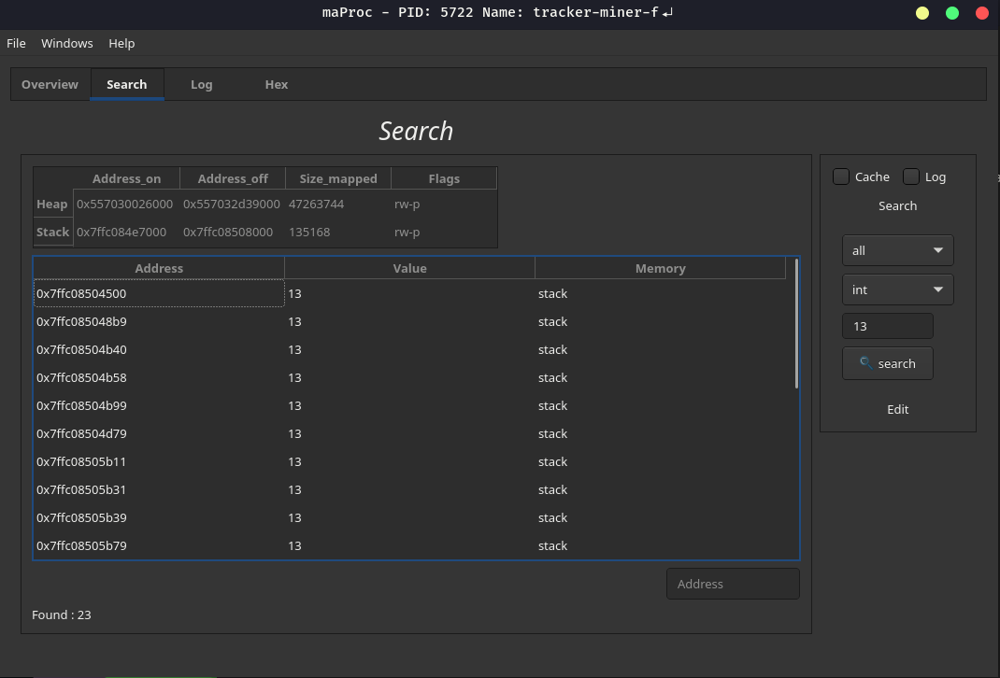

# maProc 🐉
As the name maProc informs, it will map processes in linux, being able  to check a process's stack/heap, being able to change the memory with write permission,  you can manipulate the process by sending a SIGNAL and can stop or pause it process.

# Infos ℹ️
> Made in C++ lang

> Maproc will easily change the memory without depending on ptrace, however we will depend on the support of the system to contain the pseudo directory `/mem`, otherwise reading and writing in memory will not be possible,we intend to implement it with ptrace in the future.

> [License](LICENSE) BSD 2-Clause

> [DEPENDENCIES](DEPENDENCIES.md)

# About ©️
we will make the maProc libs available in the following organization [CoffeeCode](https://github.com/0xc0ffeec0de), create your own maProc.
The project's main creators are [Mob](https://github.com/VitorMob), [Buzzer](https://github.com/AandersonL) with all copyrights to Mente Binária.

# Features 🔥

* Stop Process
* Kill Process
* Hex View
* Read Memory
* Edit Memory
* Infos Pid
* Infos Executable
* Infos OS

# Compile 🖨️

> Commands

    cd maProc
    mkdir build
    cd build
    cmake ..
    make

# Pages 📄

* [Home](https://github.com/mentebinaria/maProc/wiki)
* [Help](https://github.com/mentebinaria/maProc/wiki/Help)

# Features for version 0.2.0
- [ ] Create tab maps
- [ ] Execute commands in shell maProc ex:  read 0x5d7f324fa5  
- [ ] Find values memory in address maps
- [ ] New help in wiki pages 
- [x] Repage Layout 
- [ ] Save Log
- [x] Full Screen
- [ ] Date in log  
- [ ] Status loading search memory 
- [ ] Simple infos ELF 
- [ ] Cpu graphics utilizade to process

# Screenshots 🎦

