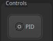
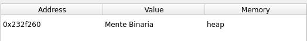
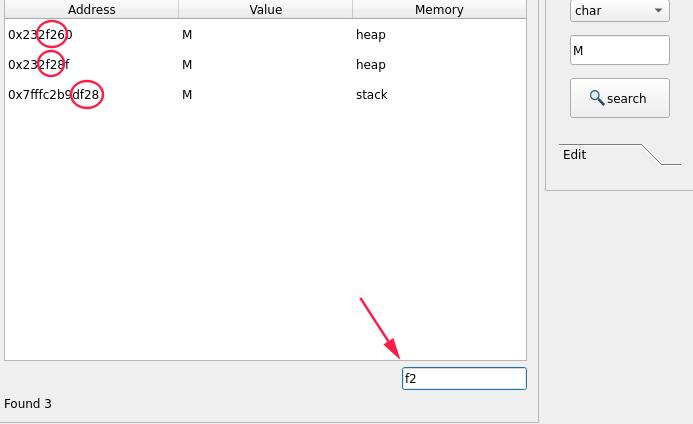
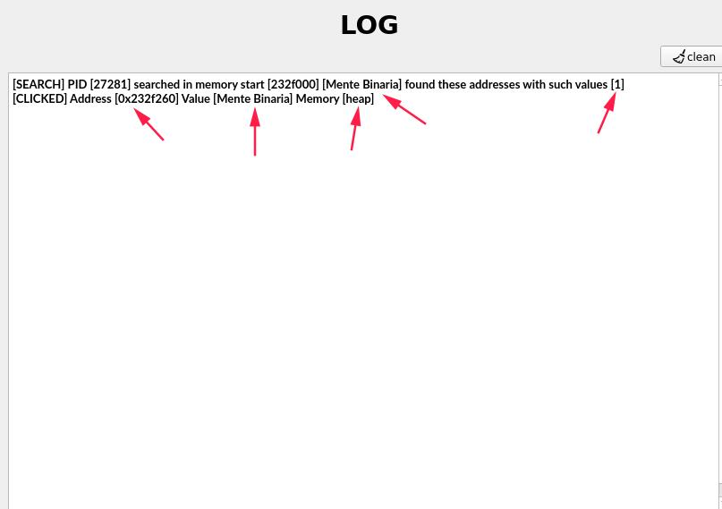
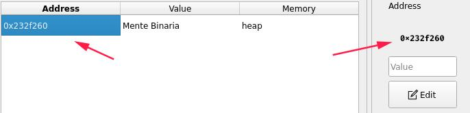
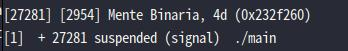
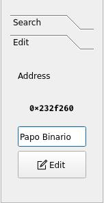

# maProc
As the name maProc informs, it will map processes in linux, being able  to check a process's stack/heap, being able to change the memory with write permission,  you can manipulate the process by sending a SIGNAL and can stop or pause it process.

# About
we will make the maProc libs available in the following organization [CoffeeCode](https://github.com/0xc0ffeec0de), even shout your maProc.
The project's main creators are [Mob](https://github.com/VitorMob), [Buzzer](https://github.com/AandersonL) with all copyrights to Mente Binária.

# Infos
The project is done in the C++ language.

[License](LICENSE) BSD

Dependency to compile code
`apt install qtcreator  g++ cmake`

# Help

##### Pid Button
To use maproc is very simple, you will need a process running on your machine on which you want to map,the button will check all processes on your machine that are currently running
 Note: it will only bring up processes that maProc has permission to check, if the process is running in `root` and maproc running on a user that does not have permission to check such a process will not bring it to be selected

##### Overview Table
after the pid selection, the process will start to check and bring information about the process, we can check the `Overview` table, we can have the following information, information about the pid, about the executable and information about our host machine.

##### Search Table

search table will try to map the process in memory
bringing some information, such as addresses where stack/heap starts and ends and the size of each one with the permission flags, in the left part of the table, we can look for both the stack and the heap, or both, for example

 

we can notice that I'm looking in the heap, the string value `Mente Binaria`,from there, maProc will scan all the process memory on the heap, looking for all the strings it finds `Mente Binária`
 
we can see that maProc found this address containing our searched string. 

Note: if a value appears many times in several addresses and you have an idea where the string address starts, just do a search in the table.

##### Log 

We can save our actions in the maproc log, so we can always consult and check what we changed in the process and possible errors during the process, just check the checkbox, titled as Log

We can check our logs on the LOG page 

With the checkbox checked we can check what we have done so far

#### Edit

We can take a look at the edit page, we will need the following information for in-memory editing, Address, Value, double clicking on the table containing the address, you will add the address you want to edit  

with the process paused or running, we can change the string allocated on the heap as maproc showed us, and check if it was changed correctly,in the process that the string "Binary Mind" is allocated, I paused the process by sending a signal with the
 

This way my process stopped, we can see in my terminal

Note: Repeating, it is *not necessary* to pause a process to be able to change the memory, I just demonstrated the `STOPP` button.

as an editing choice, I chose to add such a string for editing our process `Papo Binario`

We can notice that in the terminal where the process is being executed with the string `Mente Binaria`, it was changed to `Papo Binario`

We can check the log if the string was changed

If you want to end the process, just kill it 

